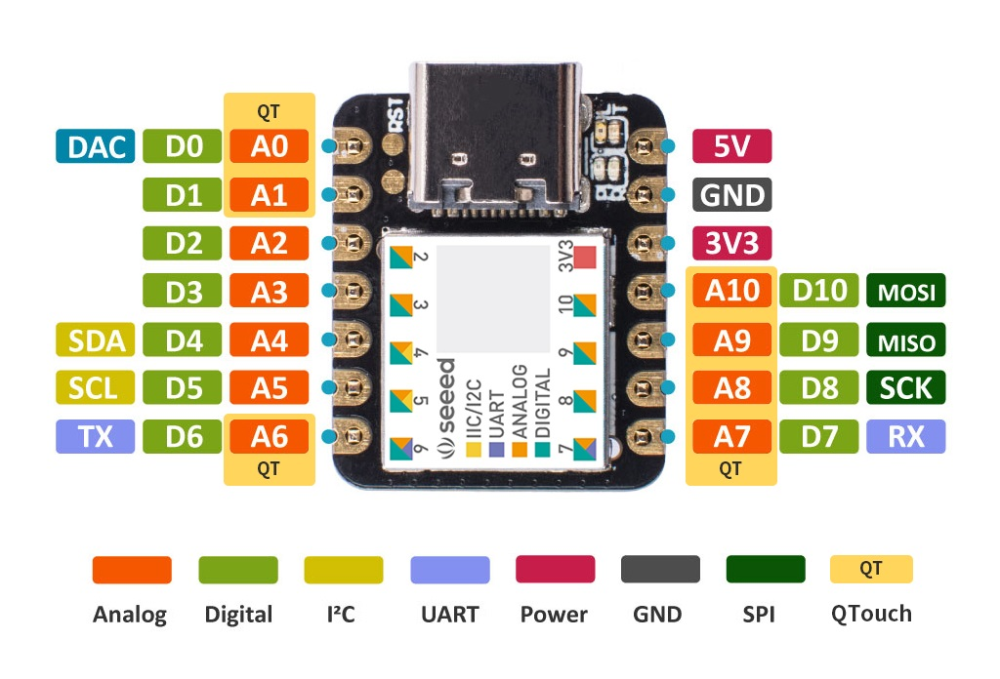

# New Keyboard Shield

手順

1. シールドを格納するための新しい Zephyr モジュールを作成
1. 新しいシールドディレクトリを作成
1. 基本となる Kconfig ファイルを追加
1. シールドオーバーレイファイルを追加して定義
   - キーの押下／開放を検出するスキャンドライバー
   - キーボードスキャンの行／列のあたいをキーマップのキーの位置にマッピングするためのマトリクス変換
   - マトリクス変換とキーボードスキャンインスタンスを選択するための物理レイアウト定義
1. デフォルトのキーマップを追加。（ユーザーは必要に応じて独自設定で上書き可能）
1. シールドの概要とそれがサポートする機能を文書化するために、<my_shield>.zmk.yml メタデータ ファイルを追加します。

※Zephyr: 組み込みシステム向けの OS

## 1. 新しい Zephyr モジュール リポジトリを作成

シールドを作成するための最初のステップは、テンプレートから新しい Zephyr モジュール リポジトリを作成することです。

_注. Github アカウント必須_

1. https://github.com/zmkfirmware/unified-zmk-config-template にアクセス。
1. 右上緑のの「Use this template」ボタンを押下
1. 表示されたドロップダウンから「Create a new repository」を選択
   - repository name: "my-shield-module"
   - description : "ZMK Support For MyShield keyboard."
   - Private か Public かを選択
1. 緑の「Create Repository」を押下

リポジトリは **ZMK コンフィグに必要なディレクトリとファイル**と、**シールドモジュールに必要なディレクトリとファイル**の組み合わせです。

シールドモジュールを作成するには、以下のコンポーネントが必要です：

- boards/shields ディレクトリ: キーボードのファイルが置かれる。
- zephyr/module.yml ファイル: モジュールを識別して説明します。このファイルのカスタマイズの詳細については、[Zephyr のドキュメント](https://docs.zephyrproject.org/3.5.0/develop/modules.html#module-yaml-file-description)を参照してください。シールド モジュールを作成する目的では、テンプレートのデフォルトはそのままにしておくことができます。

どちらも親ディレクトリから移動させるべきではありません。 config のような他のファイルやディレクトリは、シールド・モジュールの目的には必要ではなく、むしろユーザーの設定やテストに使われることを意図しています。

## 2. 新しいシールドディレクトリを作成

`zephyr/module.yaml`の `board_root`にあるシールドは boards/shields/ディレクトリに配置されます。下記コマンドで新しいシールドディレクトリを作成します。

```
mkdir boards/shields/<keyboard_name>
```

## 3. 基本となる Kconfig ファイルを追加

新しいキーボード シールドを ZMK で使用できるようにするために、`Kconfig.shield` と `Kconfig.defconfig` という 2 つの必須 Kconfig ファイルを作成する必要があります。

### Kconfig.shield

#### Unibody Keyboard

Kconfig.shield ファイルは、キーボードの構築に使用されるシールド名を定義します。

```
# カンマの後やキーボード名には空白を入れないでください。
config SHIELD_MY_KEYBOARD
    def_bool $(shields_list_contains,my_keyboard)
```

これにより、my_keyboard がシールド名として使用されるときは常に、SHIELD_MY_KEYBOARD フラグが y に設定されます。 SHIELD_MY_KEYBOARD フラグは、シールドに関する他のプロパティを設定するために**Kconfig.defconfig**で使用されるので、それらが一致していることを確認してください。

#### Split Keyboard

Kconfig.shield ファイルは、あなたのキーボードを構築するために使用されるシールド名を定義します。 分割キーボードは、各部分に 1 つずつ、複数のシールド名が定義されています。 例えば、あなたのキーボードが my_keyboard_left と my_keyboard_right という名前の 2 つの半分で構成されている場合、以下のようになります：

```
# カンマの後やキーボード名には空白を入れないでください。
config SHIELD_MY_KEYBOARD_LEFT
    def_bool $(shields_list_contains,my_keyboard_left)

# カンマの後やキーボード名には空白を入れないでください。
config SHIELD_MY_KEYBOARD_RIGHT
    def_bool $(shields_list_contains,my_keyboard_right)
```

これにより、my_keyboard_left がシールド名として使用されるときは常に、SHIELD_MY_KEYBOARD_LEFT フラグが y に設定される。 同様に、my_keyboard_right がシールド名として使われると、SHIELD_MY_KEYBOARD_RIGHT フラグが y に設定されます。SHIELD_MY_KEYBOARD_LEFT フラグと SHIELD_MY_KEYBOARD_RIGHT フラグは、Kconfig.defconfig でシールドに関する他のプロパティを設定するために使われるので、それらが一致していることを確認してください。

### Kconfig.defconfig

Kconfig.defconfig ファイルは、このシールドを使用する際にコンフィギュレーション設定の新しいデフォルト値を設定するために使用されます。

通常、ここで新しいデフォルト値が設定される主な項目の 1 つは ZMK_KEYBOARD_NAME 値で、USB や BLE 上でのデバイスの表示名を制御します。

更新された新しいデフォルト値は、常に **Kconfig.shield ファイルで定義されたシールドのコンフィグ名**に関する条件の中でラップされなければならない。

※.コンフィギュレーション設定とは、システムやソフトウェアの動作を制御するための設定情報を指します。これにより、特定のハードウェアやソフトウェアの機能を有効化したり、動作のパラメータを調整したりすることができます。設定は通常、設定ファイルやユーザーインターフェースを通じて行われます。

#### Unibody Keyboard

```
if SHIELD_MY_KEYBOARD

# 名前は16文字以内でなければならない！
config ZMK_KEYBOARD_NAME
    default "My Keyboard"

endif
```

#### Split Keyboard

スプリットキーボードの場合、このファイルのコンフィギュレーションで中心側（通常は左側）を指定する。
その側にはキーボード名が割り当てられ、中央コンフィグが設定される。
ペリフェラル側には名前は割り当てられない。 最後に、スプリットコンフィグを両サイドに設定する必要がある。

※.ペリフェラル（Peripheral）とは、コンピュータやデバイスの中心的な部分（中央側）に対して、周辺に位置する部分を指します。スプリットキーボードの文脈では、中心側（通常は左側）に対して、もう一方の側（通常は右側）をペリフェラル側と呼びます。ペリフェラル側は、中心側に対して補助的な役割を果たします。

```
if SHIELD_MY_KEYBOARD_LEFT

# 名前は16文字以内でなければならない！
config ZMK_KEYBOARD_NAME
    default "My Keyboard"

config ZMK_SPLIT_ROLE_CENTRAL
    default y

endif

if SHIELD_MY_KEYBOARD_LEFT || SHIELD_MY_KEYBOARD_RIGHT

config ZMK_SPLIT
    default y

endif
```

### User Configuration Files

Kconfig.shield ファイルと Kconfig.defconfig ファイルに加え、多くのシールドは my_keyboard.conf というユーザー設定ファイルも定義します。
このファイルは、ディープスリープの有効化など、ユーザーが選択できるコンフィギュレーション設定の「提案」を提供するために存在します。
この名前は、Kconfig.shield ファイルで定義された shield/part 名と一致する必要があることに注意してください。

> 注意：このファイルは、コンフィギュレーション・オプションの設定にも使用できる。 しかし、このファイルにフラグが設定されると、 ユーザーはそのフラグを変更できなくなる。 必要な場合もあるが、この方法でコンフィギュレーション・オプションを設定することは推奨されない。 この方法が必要なケースは、将来的に廃止される予定であり、この方法は冗長になる。

## シールドオーバーレイファイルを追加して定義

シールド・オーバーレイ・ファイルには、ファームウェアのビルド・プロセスでプライマリ・ボードのデバイ スツリーの記述とマージされるデバイセズリーの記述が含まれている。 このファイルで定義する必要があるのは、主に 3 つである。

- キーボードスキャン（kscan）ドライバー。キー押下イベントをスキャンする GPIO ピンを決定します。
- kscan とキーマップの "橋渡し "をするマトリックス変換。
- 上記を集約し、(オプションで) キーボードを [ZMK Studio](https://zmk.dev/docs/features/studio) で使用できるように物理的なキーの位置を定義する物理レイアウト。

※.ZMK Studio は、ZMK 搭載デバイスにランタイム更新機能を提供し、ユーザーはキーボードに新しいファームウェアをフラッシュすることなくキーマップ レイヤーを変更できます

ユニボディ キーボードを作成の場合、my_keyboard.overlay という名前の単一のオーバーレイ ファイルが定義され、スプリットキーボードの場合、次のように分割された部分ごとにオーバーレイファイルが定義されます。ここででのファイル名は、Kconfig.shield ファイルで定義されたシールド名です。

- my_keyboard_left.overlay
- my_keyboard_right.overlay

スプリットキーボードでは、デバイスツリーの記述の一部を共有することがよくあります。標準的な方法として、コアとなる my_keyboard.dtsi（デバイスツリーインクルード）ファイルを作成し、それを各シールドオーバーレイに含めるという方法があります。

### Kscan

kscan ノードは、キーの押下や離上げイベントをスキャンするために使用されるコントローラーの GPIO ピンを定義します。これらのピンは、以下のピンアウトに記載されている GPIO ラベルを使用して参照されます。

具体的には、kscan ノード内でどの GPIO ピンがキーのスキャンに使用されるかを指定し、そのピンがキーの押下や離上げを検出する役割を果たします。



ZMK では、D2 など、"D "プレフィックスで緑色に色分けされたピン名を使用して、devicetree のノード参照を生成します。 例えば、図中の D0 と書かれたピンを参照するには、デバイ スツリーファイルで`&xiao_d 0` を使用します。

上記のインターコネクトに含まれない GPIO ピンを使用するには、各コントローラ・タイプに固有の GPIO ラベルを使用します。 たとえば、nRF52840 ベースのボードで PX.Y と番号付けされたピンは、&gpioX Y ラベルで参照できます。 例えば、nice!nano がボードの中央に露出する P1.07 ピンは&gpio1 7 です。

[キーボード スキャン構成ドキュメント](https://zmk.dev/docs/config/kscan)には、kscan ドライバーの構成に関する詳細が記載されています。

単純な 3x3 マクロパッド マトリックスの場合、kscan は次のようになります。

my_keyboard.overlay

```
/ {
    kscan0: kscan0 {
        compatible = "zmk,kscan-gpio-matrix";
        diode-direction = "col2row";
        wakeup-source;

        col-gpios
            = <&xiao_d 4 GPIO_ACTIVE_HIGH>
            , <&xiao_d 5 GPIO_ACTIVE_HIGH>
            , <&xiao_d 6 GPIO_ACTIVE_HIGH>
            ;

        row-gpios
            = <&xiao_d 7 (GPIO_ACTIVE_HIGH | GPIO_PULL_DOWN)>
            , <&xiao_d 8 (GPIO_ACTIVE_HIGH | GPIO_PULL_DOWN)>
            , <&xiao_d 9 (GPIO_ACTIVE_HIGH | GPIO_PULL_DOWN)>
            ;
    };
};
```

※.スプリットキーボードは割愛

### Matrix Transform

マトリックス変換は、行／列イベントを「キーポジション」イベントに変換するために使われる。

キーが押されると、イベントをトリガーした row-gpios ピンと col-gpios ピンのゼロベースのインデックスにそれぞれ対応する row と column の値を持つ kscan イベントがそこから生成される。 そして、トリガーされた「キーポジション」は、マトリックス変換における RC(row, column)のインデックスとなる。 このキーポジションは、キーマップ内で動作バインディングに関連付けられます。

#### Unibody keyboard

キーが押されると、イベントをトリガーした row-gpios ピンと col-gpios ピンのゼロベースのインデックスにそれぞれ対応する row と column の値を持つ kscan イベントがそこから生成される。 そして、トリガーされた「キーポジション」は、マトリックス変換における RC(row, column)のインデックスとなる。 このキーポジションは、キーマップ内で動作バインディングに関連付けられます。

以下は、前の 3x3 マクロパッドのマトリックス変換の例です。

my_keyboard.overlay

```
#include <dt-bindings/zmk/matrix_transform.h> // これを他のインクルードと一緒にオーバーレイの上部に配置します

/ {
    default_transform: keymap_transform0 {
        compatible = "zmk,matrix-transform";
        columns = <3>; // Length of the "col-gpios" array
        rows = <3>; // Length of the "row-gpios" array
        map = <
        //   Key 1 | Key 2 | Key 3
            RC(0,0) RC(0,1) RC(0,2)
        //   Key 4 | Key 5 | Key 6
            RC(1,0) RC(1,1) RC(1,2)
        //   Key 7 | Key 8 | Key 9
            RC(2,0) RC(2,1) RC(2,2)
        >;
    };
};
```

マトリックス変換は、ピンの順序をキーの物理的な順序にもっと近いものに「修正」するためにも使用されます。異常なピンの順序の原因には次のものがあります。

- 使用するピンを減らすため、GPIO マトリックスには、実際のキースイッチの行／列の物理的なレイアウトとは一致しない「効率的な」行／列数が使用されています。
- 親指クラスター、1U 以外の位置などがある非長方形キーボード用。

より複雑な行列変換の例については、ZMK が定義する[ツリー内キーボード](https://github.com/zmkfirmware/zmk/tree/main/app/boards/shields)を参照してください。

また、マトリックス変換の詳細と例については、[キーボードスキャン設定ドキュメント](https://zmk.dev/docs/config/layout#matrix-transform)のマトリックス変換セクションを参照してください。

### Physical Layout [物理的なレイアウト]

キーボードには物理レイアウトを定義する必要があります。 物理レイアウトの定義方法については、[物理レイアウトの専用ページ](https://zmk.dev/docs/development/hardware-integration/physical-layouts)をお読みください。 物理レイアウトの作成が完了したら、作成したファイルをインポートしてください。
